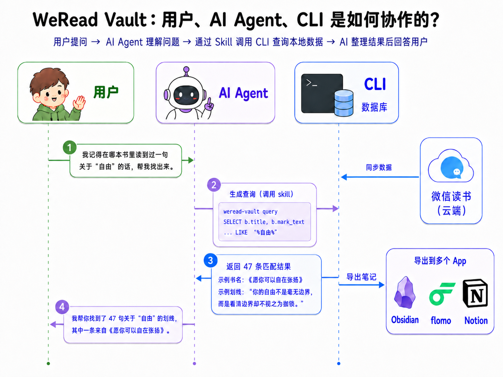

# WeRead Vault

**微信读书的本地数据库 —— 一个带 Agent Skill 的 CLI。** 把书架、划线、想法、阅读统计归档进本机 SQLite，可查询、可视化、可导出，AI 直接读，数据不上传。


> 个人数据归档工具，不是微信读书官方客户端。请遵守微信读书服务条款，只同步自己的数据。

## 它是怎么工作的

你提问 → AI Agent 通过 Skill 调用 `weread-vault` 查本地数据库 → 整理后回答。比如「我记得在某本书里读到过一句关于『自由』的话，但忘了是哪本」——一条 SQL 就从你全部划线里搜出来了。



## ✨ 特点

- 🔒 **本地优先**：所有数据都存在本机的一个 SQLite 文件里，可备份、可迁移、能离线用，永不上传；本地网页也只监听 `127.0.0.1`。
- 📚 **完整书架**：把整个书架都同步下来——连没做笔记的书也在，公众号单独归类，而不只是有划线的那一部分。
- 📊 **阅读统计**：按周、月、年、全部切换，数字随之变化——读得最久的书、偏爱的分类、常读的时段、同比涨跌、单次时长分布，还有 GitHub 式的划线热力图（纯 SVG 渲染，零依赖）。
- 🔥 **不只是你自己**：除了自己的划线，还能看「大家都在划的句子」（含人数、可按原文顺序）和公开书评；还能搜微信读书书城、顺着同一作者找到更多书。
- 🤖 **AI 原生**：一套命令行就把微信读书接口、只读 SQL 查询、已解析的统计 JSON 都交给 AI——Claude Code、Codex、OpenClaw 拿来就能用；自带荐书 Skill。
- 📝 **导出到你的知识库**：导出成 Markdown（带封面，可合并他人热门划线并去重），或一键同步到 Obsidian、flomo、Notion。
- 🧰 **零第三方依赖**：纯 Python 标准库 + SQLite，有 Python 就能跑。

## 📦 安装

三种方式，从最省心到最灵活；每种都能顺带装上给 AI 用的 Skill。

### ① 让 AI agent 帮你装（最省心，推荐）

把这段发给 Claude Code / Codex / OpenClaw，它会装好命令行、启用 Skill 并打开 Dashboard：

```text
请帮我装好 WeRead Vault 并启用它的 Skill：
1) pipx install weread-vault（没有 pipx 就用 uvx weread-vault serve --open）
2) 把 https://github.com/dull-bird/weread-vault 的 skills/weread-vault-cli 装成你的 Skill
3) 跑 weread-vault serve --open，打开后提醒我去 https://weread.qq.com/r/weread-skills
   取微信读书 API Key 粘贴同步。数据只存我本机，别把 key 写进任何文件。
```

### ② 桌面 App + Skill（不想碰命令行）

到 [Releases](https://github.com/dull-bird/weread-vault/releases/latest) 下载，双击即用：

- **macOS**：`weread-vault-macos.dmg` —— 把 `WeRead Vault.app` 拖进「应用程序」双击。
- **Windows**：`weread-vault-windows-setup.exe` —— 安装并自动把 `weread-vault` 注册到 PATH（也有 portable 版 `weread-vault.exe`）。

启动后浏览器自动打开，在「同步设置」粘贴 [API Key](https://weread.qq.com/r/weread-skills) 同步。想给 AI 用：在「同步设置」里点「注册 weread-vault 命令」（macOS）并按「安装 Skill」提示操作。

> 首次未签名提示（正常现象）：macOS 右键 App →「打开」；Windows 点「更多信息 → 仍要运行」。一次即可。

### ③ 命令行 + Skill（开发者，macOS / Windows / Linux，需 Python 3.10+）

```bash
uvx weread-vault serve --open     # 免安装、临时跑
pipx install weread-vault         # 或常驻安装，weread-vault 命令上 PATH
```

给 agent 用就再装 Skill：仓库的 [`skills/weread-vault-cli`](skills/weread-vault-cli/SKILL.md)。要从源码：`git clone --recurse-submodules … && pip install -e .`。

**升级**：`weread-vault update` 检查新版，`weread-vault update --download` 下载安装包。项目主页：<https://dull-bird.github.io/weread-vault/>。

## 📊 阅读统计

按本周 / 本月 / 今年 / 全部切换，所有数字随之更新；GitHub 式热力图展示每日划线活跃度（多年）。全部来自历史快照，随每次同步累积，能看到长期趋势。


GitHub 式划线热力图，跨多年一目了然：


## 📖 书籍详情

进度与推荐值用进度条体现书间差异，划线/想法用颜色标记。四个 tab：**我的笔记 / 热门划线 / 书评 / 相关推荐**——每条笔记都能一键复制，还能跳转到微信读书。


热门划线可按「原文顺序」或「按热度」排列，看到大家都在划的句子（含人数）：


还能看这本书的公开书评，以及同作者的相关推荐：


## ⌨️ 常用命令

```bash
weread-vault sync                  # 日常增量同步（书架 + 笔记 + 统计）
weread-vault sync info             # 补全评分/字数/出版社/ISBN（一次性回填）
weread-vault status                # 本地库数量与最近同步状态
weread-vault serve --open          # 本地网页预览

# 导出
weread-vault export markdown --out ~/Documents/weread-notes
weread-vault sync popular && \
  weread-vault export markdown --out ~/Documents/weread-notes --with-popular   # 合并他人热门划线（去重）
weread-vault export flomo --webhook "$FLOMO_WEBHOOK"
weread-vault export notion --token "$NOTION_TOKEN" --database "$NOTION_DATABASE_ID"

# 备份 / 换账号
weread-vault backup --out ~/Backups/weread-vault.db
weread-vault reset --yes           # 清空本地阅读数据（换账号前用，不影响 API Key）
```

所有命令可加 `--db /path/to/file.db` 使用另一份数据库（不同账号开独立库，避免串扰）。

## 🤖 给 AI 用：CLI + Skill

CLI 把整套微信读书 Skill API 暴露成命令，输出 JSON，让 agent 直接取数据——书城搜索、他人热门划线、公开书评、富书籍信息等：

```bash
weread-vault apis                       # 列出全部接口及参数（agent 自助发现）
weread-vault search "三体" --count 5     # 书城搜索
weread-vault book <bookId> popular      # 他人热门划线（含人数）
weread-vault book <bookId> reviews      # 公开书评
weread-vault api <endpoint> key=value   # 任意接口原样透传
```

让 AI 灵活分析本地数据：

```bash
weread-vault query --schema     # 表结构 + 字段说明 + 示例 SQL（AI 据此写查询）
weread-vault query "SELECT title, rating FROM books WHERE rating>0 ORDER BY rating DESC LIMIT 10"
weread-vault stats              # 已解析统计 JSON（周期 / 热力图 / 单次时长 / 读得最多）
```

接入 Claude Code 后，问「我评分最高的书」「哪个分类笔记最多」，AI 会自己 `query --schema` 再写 SQL 回答。荐书 Skill [`skills/weread-recommend`](skills/weread-recommend/SKILL.md) 会结合你的口味、书城和联网，按主题推荐不与已读重复的书。

**一个具体例子** —— 你问「这周读得最久的书是哪本？」AI 会这样做（完整说明见 [SKILL.md](skills/weread-vault-cli/SKILL.md#端到端示例这周读得最久的书是哪本)）：

1. 判断：阅读**时长**不在 SQL 表里，在统计快照里 → 用 `weread-vault stats`（不是 `query`）。
2. 跑 `weread-vault stats`，读返回 JSON 的 `periods.weekly.longest[0]`：
   ```json
   { "title": "财富的真相", "author": "李笑来", "readSeconds": 916 }
   ```
3. 答你：「这周读得最久的是《财富的真相》（李笑来），约 15 分钟。」

（「笔记最多/评分最高的书」这类目录问题才转 `query` 写 SQL。选对工具是关键。）

> 官方接口不开放全书正文，「划线前后那一整段原文」拿不到；也不提供「某一年每本书读了多久」。这些限制我们如实标注，不虚构数据。

## ⚡ 相比官方微信读书 Skill 的优势

官方 Skill 是 17 个**无状态、按单本书查**的接口（`/book/bookmarklist`、`/review/list/mine`、`/readdata/detail`……）。WeRead Vault 把这些接口的数据**一次性归档进本地 SQLite**，于是「按书查」变成「随便查」——这就是根本区别。

| 你想做的事 | 官方微信读书 Skill | **WeRead Vault** |
|---|---|---|
| 拿到划线 | 只能**一次一本**（`/book/bookmarklist` 必填 bookId） | 全部划线归档本地，按任意条件查 |
| **搜遍所有划线找某一句话** | 先翻完所有书清单，再**逐本调接口几百次**，拉回本地自己筛 | 一条 SQL 全文检索，**毫秒级**：`query "SELECT … FROM highlights WHERE mark_text LIKE '%自由%'"` |
| **跨书聚合**（每分类几本、作者排行、笔记最多） | 无聚合接口，得拉全量再自己算 | 一条 `GROUP BY` |
| 任意维度统计 | 只有官方预设的周/月/年口径 | 只读 SQL，想怎么查怎么查 |
| 持久化 / 离线 | ❌ 每次重新拉、必须联网 | ✅ 单文件 SQLite，可备份、迁移、离线 |
| 阅读统计可视化 | 只给原始 JSON | 周/月/年切换、热力图、碎片化结论、读得最多排行等看板 |
| 他人热门划线 | 有接口，但要逐本调、不留存 | 同步进库，可与**自己的划线合并去重**一起导出 |
| 导出到笔记软件 | ❌ 无 | ✅ Markdown / Obsidian / flomo / Notion |
| 喂给 AI | 给的是一堆原始接口，AI 得自己编排几百次调用 | `query` / `stats` / `api` 三个命令 + 自带 Skill，AI 一条命令拿到答案 |
| 增量同步 / 事务安全 | ❌ 无状态 | ✅ 变更水位 + 失败重试，不漏不重 |
| 换账号隔离 | — | `--db` 独立库 + 账号指纹提示 |

**一个例子**：「我记得在某本书里读到过一句关于『自由』的话，但忘了是哪本。」

- 用 WeRead Vault：一条命令，瞬间从你全部划线里搜出所有命中——
  ```bash
  weread-vault query "SELECT b.title, h.mark_text FROM highlights h
    JOIN books b ON b.book_id=h.book_id WHERE h.mark_text LIKE '%自由%'"
  ```
- 用官方 Skill：`/book/bookmarklist` 一次只能查一本书，你得翻完整个书架、**逐本调接口几百次**、把几千条划线拉到本地拼起来再筛——几分钟、可能被限流，而且**每次搜都要重来一遍**。

## ⏰ 每天自动同步

一句命令，让系统每天到点自动跑一次同步——**不常驻、不占后台、关机重开照常**，跨 macOS / Windows / Linux 一致。你不用自己写 crontab：

```bash
weread-vault schedule --daily 07:00          # 每天 07:00 自动同步
weread-vault schedule --daily 07:00 \
  --export "~/Documents/Obsidian Vault/微信读书"   # 同步后顺便导出到 Obsidian
weread-vault schedule --status               # 查看状态
weread-vault schedule --off                  # 关闭
```

它在底层注册系统**原生定时器**（macOS launchd / Windows 任务计划 / Linux cron），到点唤起 `weread-vault` 同步一次就退出，省心又稳。

**桌面 App 用户**更简单：在「同步设置」里打开「每天自动同步」开关、选个时间即可，全程不碰命令行。

> 提示：API Key 需已保存到**本机配置**（在 Dashboard「同步设置」里粘贴保存即可），定时任务才读得到；只放在环境变量里的 Key，定时任务读不到。CLI 也会在你没存配置 Key 时给出提醒。

<details>
<summary>进阶（可选）：用 AI agent（OpenClaw）跑定时同步</summary>

**已开启上面的「每天自动同步」就不需要这段了。** 它只留给已经在用 OpenClaw、想让 agent 顺带处理失败日志的人。就算把它也设成 07:00、和内置每天同步撞在一起也没关系：`weread-vault sync` 带了跨进程互斥锁，同一时刻只会跑一个，另一个自动跳过、不会损坏数据库。

如果你已经在用 OpenClaw，可以让 agent 每天唤起一个隔离任务跑同步并导出，顺带把失败日志交给 agent 处理：

```json
{
  "name": "weread-vault daily sync",
  "schedule": { "kind": "cron", "expr": "0 7 * * *", "tz": "Asia/Shanghai" },
  "sessionTarget": "isolated",
  "payload": {
    "kind": "agentTurn",
    "message": "先读取 ~/.weread.env 获取 WEREAD_API_KEY，在 ~/projects/weread-vault 运行 weread-vault sync，成功后 weread-vault export markdown --out \"~/Documents/Obsidian Vault/微信读书\"。失败保留日志，不要打印 API Key。",
    "timeoutSeconds": 1800
  },
  "delivery": { "mode": "announce" }
}
```

</details>

## 🔐 同步与安全

`weread-vault sync` 分段进行：分页拉取书目并记录每本书的远端变更标记；只同步新增/有变更的书，每本书的划线和想法先完整拉取、两类请求都成功后才用一个 SQLite 事务写入并推进标记——失败的书不标记「已同步」，下次自动重试；阅读统计按时间快照保存，不覆盖旧快照。

`vendor/tencent-weread-skill` 是腾讯 [Tencent/WeChatReading](https://github.com/Tencent/WeChatReading) 的 submodule。更新官方协议：`./scripts/update-official-skill.sh`，审阅后再升级 `SKILL_VERSION` 并跑测试。

## 🛠 开发与测试

```bash
python -m unittest discover -s tests -v
```

### 重新生成文档截图

`docs/assets/` 里的书架、笔记、统计截图，由一份精选的示例库 [`docs/sample-data/weread-vault-sample.sql`](docs/sample-data/weread-vault-sample.sql) 渲染——真实封面、真实推荐值、真实划线与统计。重做截图：

```bash
python3 scripts/generate-sample-doc-assets.py
```

脚本读取这份 SQL 临时建库，启动本地网页，再用无头 Chrome 以 2 倍像素密度截图；需要本机有 Chrome / Chromium 和中文字体（如 Noto Sans CJK SC）。`docs/assets/how-it-works.png` 是单独的流程图，不由该脚本生成。

## License

[MIT](LICENSE)
