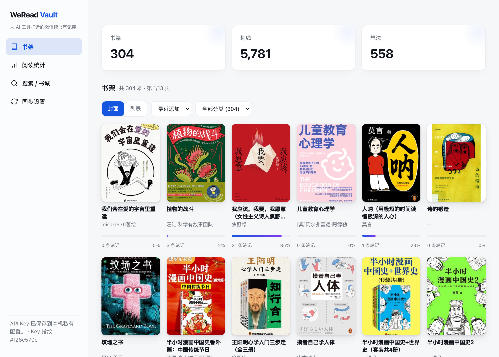
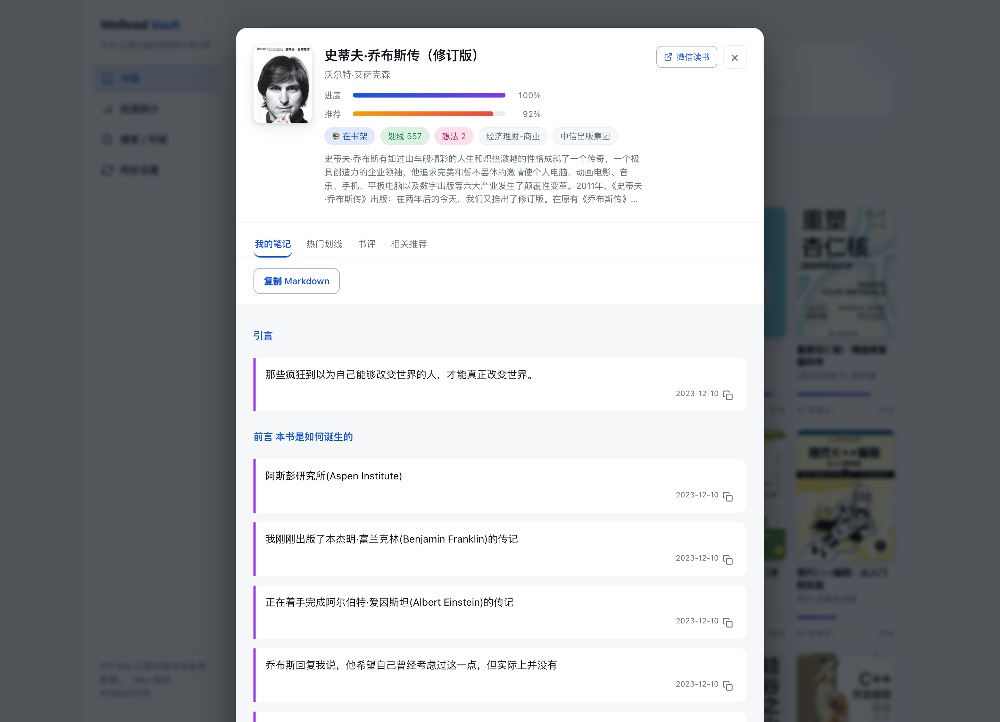
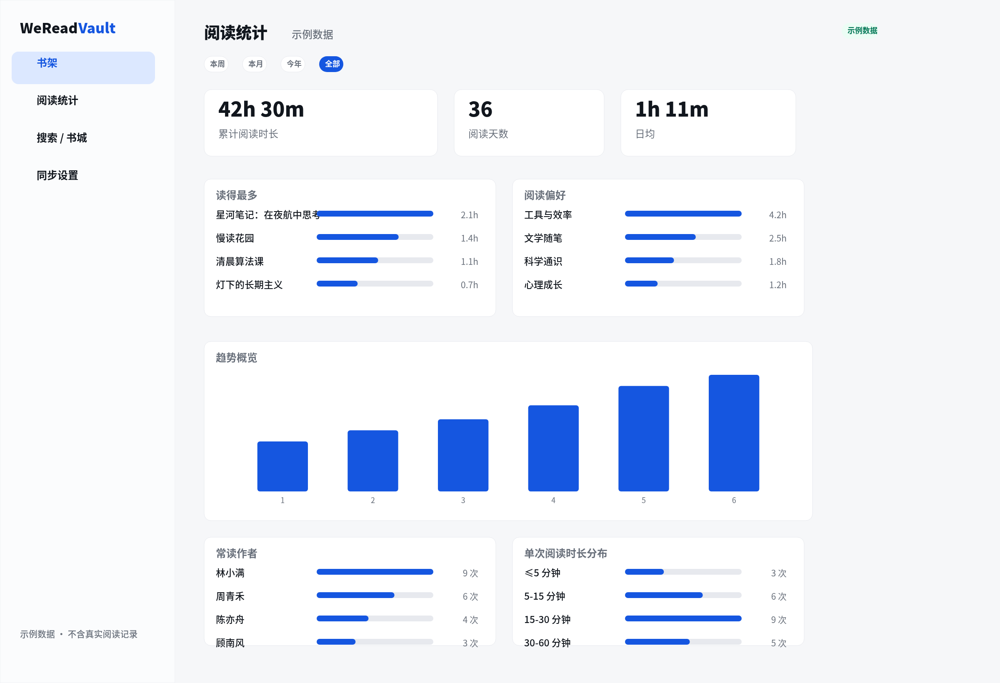
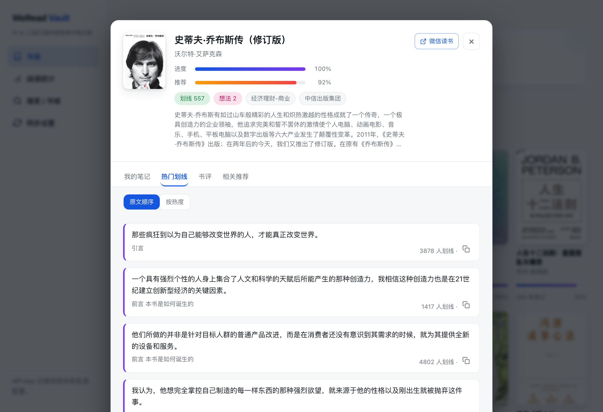

# WeRead Vault

把微信读书书架、划线、想法和阅读统计安全归档到本机 SQLite，并用一个只读本地 Dashboard 浏览、搜索和导出到 Markdown / Obsidian。

它不是云同步服务，而是面向 AI agent 和个人知识库的本地优先归档工具：数据在你的机器上，可备份、可迁移、可离线浏览，也可以交给 Claude Code、Codex、OpenClaw 等 agent 作为 Skill 使用。



> 这是个人数据归档工具，不是微信读书官方客户端。请遵守微信读书的服务条款，只同步自己的数据。

## 你可以把这段发给 AI agent 安装

把下面这段发给支持终端操作的 AI agent（Claude Code、Codex、OpenClaw 等），它就可以帮你安装并初始化本地归档：

```text
请帮我安装并运行 WeRead Vault（本地优先的微信读书归档工具，数据只存本机 SQLite，不上传）：
1. 克隆（务必带 submodule，需 Python 3.10+）：
   git clone --recurse-submodules https://github.com/dull-bird/weread-vault
2. 进入仓库后安装：python -m pip install -e .
3. 初始化并自检：weread-vault init && weread-vault status
4. 同步需要微信读书官方 Agent Skill 的 WEREAD_API_KEY。请提醒我自行到 https://weread.qq.com/r/weread-skills 获取，
   并只让我在本地终端 export 或在 WeRead Vault 本地网页里保存——不要把 key 贴进对话，也不要写进任何文件或提交到仓库。
5. 设置好 key 后增量同步：weread-vault sync
6. 打开本地只读 Dashboard 浏览书架、封面、划线、想法和阅读统计：weread-vault serve --open
7. 如果我用 Obsidian：把笔记导出成 Markdown 到我的库（一书一文件、保留我已有的 frontmatter）：
   weread-vault export markdown --out "<我的 Obsidian 库路径>/WeReadNotes"
```

适用于 Claude Code（`cc`）、Codex、OpenClaw 等任意能执行本机命令的 agent。如果你的 agent 支持 Skill，可以安装本仓库的 [`skills/weread-vault-cli`](skills/weread-vault-cli/SKILL.md)，让它把“同步微信读书”“导出到 Obsidian”“打开 Dashboard”等说法直接映射到安全的 CLI 操作。

## 为什么用它，而不是只看网页面板

- 本地优先：SQLite 单文件存储，方便备份、迁移和离线浏览。
- 事务安全：每本书的划线和想法完整拉取后才提交；失败不会推进同步标记，下次会重试。
- Obsidian 友好：可导出 Markdown，把微信读书笔记纳入你的长期知识库。
- Agent 友好：自带 Skill，可让 Claude Code、Codex、OpenClaw 等 agent 安全地操作本地数据。
- 零服务端：Dashboard 只监听 `127.0.0.1`，读取本机数据库，不上传你的阅读数据。

Dashboard 支持封面 / 列表两种视图，可按最近添加、阅读进度、笔记数量排序，并按分类筛选；点开任意一本书即可按章节浏览划线和想法（带记录日期），并一键复制成 Markdown：



Dashboard 还内置**阅读统计看板**（纯 SVG 零依赖渲染）：总阅读时长、按年趋势、24 小时时段分布、偏好分类与常读作者。这些来自历史快照，会随每次同步累积，能看到 localStorage 面板做不到的**长期趋势**：



书籍详情页支持三个 tab——**我的笔记 / 热门划线 / 书评**：除了自己的划线想法，还能看到「大家都在划的句子」（含划线人数）和这本书的公开书评。搜索框可在「本地笔记」和「书城」之间切换，直接在网页搜微信读书书城并点开任意一本看它的热门划线与书评：



## 为什么是 SQLite

你不需要懂 SQLite 才能使用它。可以把它理解成一个单文件数据库：默认位置是 Linux 的 `~/.local/share/weread-vault/weread-vault.db`（macOS/Windows 会使用各自的用户数据目录）。一个文件就包含所有同步数据，方便备份、迁移和离线浏览；数据库不在这个 Git 仓库里，也不会上传。

## 安装

需要 Python 3.10+。项目没有第三方 Python 依赖。

微信读书官方 Agent Skill 可选安装；如果你还没有 API Key，也从这里获取：[https://weread.qq.com/r/weread-skills](https://weread.qq.com/r/weread-skills)。

```bash
git clone --recurse-submodules https://github.com/dull-bird/weread-vault.git
cd weread-vault
python -m pip install -e .
weread-vault init
```

如果克隆时漏了 submodule：

```bash
git submodule update --init --recursive
```

## 最常用的命令

```bash
# 首次或日常增量同步（仅这一步需要 API Key）
export WEREAD_API_KEY='你的 key'
weread-vault sync

# 补全富书籍信息（评分/字数/出版社/ISBN），一次性回填，支持按评分、字数排序
weread-vault sync info

# 看本地数据库的数量与最近同步状态
weread-vault status

# 打开本机网页预览：http://127.0.0.1:8765/
weread-vault serve --open

# 导出 Markdown 和创建可迁移的数据库备份
weread-vault export markdown --out ~/Documents/weread-notes
weread-vault backup --out ~/Backups/weread-vault.db

# 合并导出他人热门划线（先同步，再用 --with-popular）
weread-vault sync popular
weread-vault export markdown --out ~/Documents/weread-notes --with-popular

# 导出到 flomo（每本书一条 memo，带 #微信读书 标签）
weread-vault export flomo --webhook "$FLOMO_WEBHOOK"

# 导出到 Notion 数据库（每本书一页，按章节分块）
weread-vault export notion --token "$NOTION_TOKEN" --database "$NOTION_DATABASE_ID"
```

flomo / Notion 的密钥可用 `--webhook` / `--token` 传入，或放进环境变量 `FLOMO_WEBHOOK`、`NOTION_TOKEN`、`NOTION_DATABASE_ID`（不会写进仓库或日志）。这样 readneo 有的 Notion / flomo 同步，这里也有，且数据始终先落到本机 SQLite。

所有命令可通过 `--db /path/to/file.db` 使用另一份数据库。网页只监听 `127.0.0.1`，不会暴露到局域网。

## 给 AI agent 的完整微信读书 API（卖点）

除了归档你自己的笔记，CLI 还把**整套微信读书 Skill API** 暴露成命令，让 Claude Code、Codex、OpenClaw 等 agent 可以直接取数据——书城搜索、**别人的热门划线**、**公开书评**、富书籍元信息（评分/字数/ISBN）等。这些命令输出 JSON、需要 `WEREAD_API_KEY`，不写入本地库：

```bash
weread-vault apis                       # 列出全部接口及必填参数（让 agent 自助发现能力）
weread-vault search "三体" --count 5     # 书城搜索（电子书/有声书/作者/全文等 tab）
weread-vault book <bookId> info         # 书籍富信息：评分、字数、出版社、ISBN
weread-vault book <bookId> popular      # 他人最多人划的句子（热门划线，含人数）
weread-vault book <bookId> reviews      # 这本书的公开书评/想法
weread-vault api /book/readreviews bookId=<id> chapterUid=<uid> ...   # 任意接口原样透传
```

> 微信读书官方接口不开放全书正文，所以「划线前后那一整段原文」拿不到；能接近的是全文搜索片段和同章节他人划线。这一点我们如实标注，不虚构数据。

### 让 AI 灵活分析你的阅读数据

`weread-vault query` 对本地库执行**只读 SQL**（数据库以只读模式打开，仅允许 `SELECT`/`WITH`），输出 JSON，适合交给 AI 回答任意分析问题：

```bash
weread-vault query --schema     # 先看表结构 + 字段说明 + 示例 SQL（AI 据此写查询）
weread-vault query "SELECT title, rating FROM books WHERE rating>0 ORDER BY rating DESC LIMIT 10"
weread-vault stats              # 已解析的阅读统计 JSON（含周期、热力图、单次时长分布、读得最多等）
```

接入 Claude Code 后，问「我评分最高的书」「哪个分类笔记最多」这类问题，AI 会自己 `query --schema` 再写 SQL 回答。注意：单本书的**阅读时长**只有聚合值（`stats` 的 `overall.longest`），官方接口不提供「某一年每本书读了多久」，所以精确到某一年的时长问题答不了。

基于这些命令，仓库还提供一个**荐书 Skill** [`skills/weread-recommend`](skills/weread-recommend/SKILL.md)：装进 Claude Code 后，AI 会结合你的阅读口味（`weread-vault stats`）、书城搜索、他人热门划线/书评和联网信息，按主题或关键词给出贴合口味、且不与已读重复的书单。`weread-vault stats` 也能把统计数据导出成 JSON 交给任意 AI 分析。

## OpenClaw 定时同步示例

可以用 OpenClaw cron 每天唤起一个隔离任务，让 Agent 执行 CLI 同步并导出到 Obsidian。下面示例假设：

- 仓库在 `~/projects/weread-vault`
- `WEREAD_API_KEY` 保存在 `~/.weread.env`
- Obsidian 微信读书目录是 `~/Documents/Obsidian Vault/60_Notes/微信读书`

```json
{
  "name": "weread-vault daily sync",
  "schedule": {
    "kind": "cron",
    "expr": "0 7 * * *",
    "tz": "Asia/Shanghai"
  },
  "sessionTarget": "isolated",
  "payload": {
    "kind": "agentTurn",
    "message": "同步微信读书笔记到 Obsidian：先读取 ~/.weread.env 获取 WEREAD_API_KEY，然后在 ~/projects/weread-vault 运行 weread-vault sync，成功后运行 weread-vault export markdown --out \"~/Documents/Obsidian Vault/60_Notes/微信读书\"。同步失败时保留错误日志，不要打印 API Key。",
    "timeoutSeconds": 1800
  },
  "delivery": {
    "mode": "announce"
  }
}
```

如果你更想让 cron 直接跑 shell，也可以把上述 prompt 改成调用一个本地脚本；关键点是不要把 `WEREAD_API_KEY` 写进仓库，导出目录按自己的 Obsidian 路径替换。

## 网页端同步

网页端把同步合并成一个「同步」按钮（外加一个「完整重扫」高级项）：点击后先刷新书目、封面和进度，再增量同步有变更的笔记，并追加阅读统计快照。底部进度条会先以动画表示正在拉取书架（首次可能较慢），再按 `[已完成/总数]` 填充，直到笔记全部同步完成。书架支持封面/列表视图、按最近添加/进度/笔记数/书名排序与分类筛选，点开任意一本书可按章节浏览划线与想法并复制成 Markdown。

API Key 优先读取启动 `weread-vault serve` 时终端环境里的 `WEREAD_API_KEY`；如果环境变量未设置，网页会提示你设置，并默认保存到本机用户数据目录下的私有配置文件（权限尽量设为 `0600`）。Key 不会回显到页面或 API 响应里。

## 同步是怎样保证安全的

正常的 `weread-vault sync` 分三段：

1. 分页同步所有有笔记的书目，并保存每本书的远端变更标记。
2. 只同步新增或有变更的书。每本书的划线和分页想法会先完整拉取；只有两类请求都成功后，才用一个 SQLite 事务写入并推进这本书的同步标记。失败的书不会被标记为“已同步”，下次会自动重试。
3. 保存周、月、年、总阅读统计的时间快照，不覆盖旧快照。

`weread-vault sync notes --full-notes` 可用于人工校验或修复，它会重新扫描每一本已有笔记的书。

首次试用可先只同步一小批，确认结果后再运行完整同步：

```bash
weread-vault sync notes --limit 1
```

数据边界由官方 Agent Skill 决定：目前可归档书目、划线、个人想法和统计；仅有数量而没有正文的书签、以及无法由官方接口提供的内容，工具不会虚构成可备份数据。

## 官方 Skill submodule

`vendor/tencent-weread-skill` 是腾讯维护的 [Tencent/WeChatReading](https://github.com/Tencent/WeChatReading) 仓库的 git submodule，当前使用其 `skills/` 下的微信读书 Agent Skill。更新官方协议说明：

```bash
./scripts/update-official-skill.sh
git diff --submodule
```

Submodule 更新不自动改写 CLI 的协议版本；这是有意的。先审阅官方变更、升级 `SKILL_VERSION`、跑测试后再提交，避免一个远端变更直接破坏本地同步。

## 作为 Agent Skill 使用

本仓库附带可安装 Skill：[skills/weread-vault-cli/SKILL.md](skills/weread-vault-cli/SKILL.md)。它规定了同步、导出、备份和本地预览的安全操作流程；可通过下方命令生成 `dist/weread-vault-cli.skill`。

```bash
python /path/to/skill-creator/scripts/package_skill.py skills/weread-vault-cli dist
```

给 agent 的推荐安装提示：

```text
请把当前仓库的 skills/weread-vault-cli 安装为你的本地 Skill。安装后，当我说“同步微信读书”“导出微信读书笔记到 Obsidian”“打开 WeRead Vault Dashboard”或“备份微信读书数据库”时，请使用这个 Skill，并严格遵守不要泄露 WEREAD_API_KEY 的规则。
```

## 开发与测试

```bash
python -m unittest discover -s tests -v
```

## License

[MIT](LICENSE)
